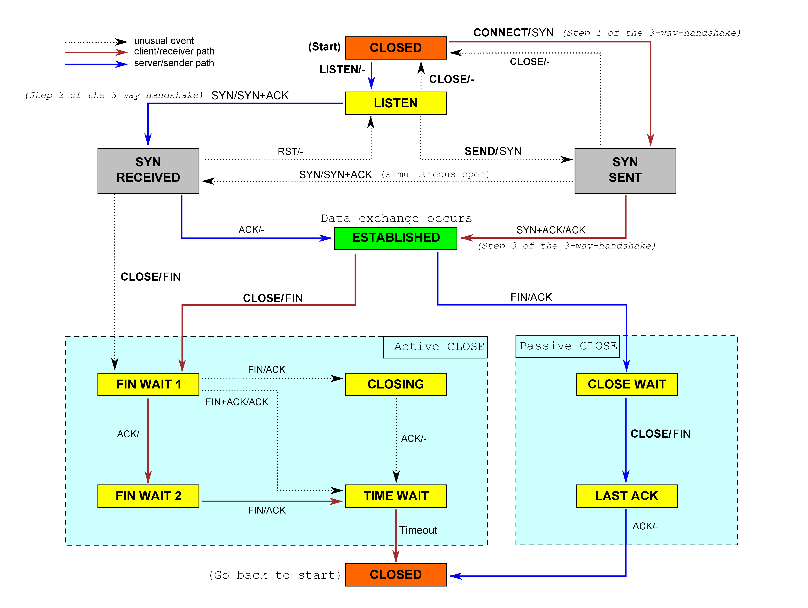

1. sender 和 connection 中都有 segment_out，根据 lab 文档的说法需要将 sender 中的 segment 放到 connection 中的 outqueue

2. FSM
FSM_LISTEN = SENDER_CLOSED && RECEIVER_LISTEN
FSM_SYN_SENT = SENDER_SYN_SENT && RECEIVER_LISTEN
FSM_TIME_WAIT = SENDER_FIN_ACKED && RECEIVER_FIN_RECV

如果 FSM 处于LISTEN 状态时，只接收带有 SYN 的报文段，并且如果收到 SYN 要更新 receiver 和发送 ack segment，即 _receiver.segment_received + _sender.fill_window

什么时候发送空包:如果收到一个seqno或者ackno无效的报文，那么也需要回传ACK，这可以用来探测主机的状态，包括是否连接以及查看 seqno 和窗口大小，也就是 keep-alive

make checklab4 执行的测试用例是带 relaxed 的版本，通过条件较为宽松

流结束时通过 end_input_stream 发送 fin 报文

2MSL = 10 * cfg.rt_timeout

tests.cmake 中各种测试用例的含义：
“c” means your code is the client (peer that sends the first syn)
“s” means your code is the server.
“u” means it is testing TCP-over-UDP
“i” is testing TCP-over-IP(TCP/IP).
“n” means it is trying to interoperate with Linux’s TCP implementation
“S” means your code is sending data
“R” means your code is receiving data
“D” means data is being sent in bothdirections
lowercase “l” means there is packet loss on the receiving (incoming segment) direction
uppercase “L” means there is packet loss on the sending (outgoing segment) direction.